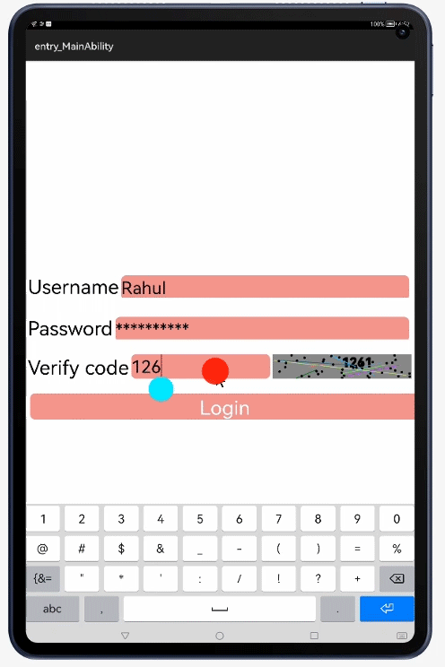

# VerificationView

A HMOS library which provides Verification code features.

## Source

Inspired by [yongming9011/VerificationCodeView](https://github.com/yongming9011/VerificationCodeView)- version 1.0

## Feature
VerificationView is a library which provides verification code where a 
verification code is a security protection method used by form owners to 
avoid Internet robots from abusing and spamming their forms




## Dependency
1. For using verificationview module in sample app, include the source code and add the below dependencies in entry/build.gradle to generate hap/support.har.
```groovy
    dependencies {
    implementation fileTree(dir: 'libs', include: ['*.jar', '*.har'])
    implementation project(path: ':verificationview')
    testImplementation 'junit:junit:4.13'
    ohosTestImplementation 'com.huawei.ohos.testkit:runner:1.0.0.100'
}
```
2. For using verificationview in separate application using har file, add the har file in the entry/libs folder and add the dependencies in entry/build.gradle file.
```groovy
	dependencies {
		implementation fileTree(dir: 'libs', include: ['*.har'])
		testImplementation 'junit:junit:4.13'
	}
```

## Usage
### Include following code in your layout
``` xml
<?xml version="1.0" encoding="utf-8"?>
 <com.zhangym.customview.VerificationCodeView
      ohos:id="$+id:verificationCodeView"
      ohos:width="0vp"
      ohos:height="50vp"
      ohos:weight="1"
      zhangym:interferenceCirclesCount="40"
      zhangym:interferenceCirclesRadius="5"
      zhangym:interferenceLinesCount="8"
      zhangym:isShowInterferenceCircles="true"
      zhangym:isShowInterferenceLines="true"
      zhangym:isTextBold="true"
      zhangym:textSize="26fp"
      zhangym:verificationText="9D27" />
```

### Include following code in your activity
``` java 
super.setUIContent(ResourceTable.Layout_ability_main);
        initViews();
        login();
        mCodeView.setClickedListener(new Component.ClickedListener() {
            @Override
            public void onClick(Component component) {
                String s = String.valueOf(mRandom.nextInt(10))
                        + String.valueOf(mRandom.nextInt(10))
                        + String.valueOf(mRandom.nextInt(10))
                        + String.valueOf(mRandom.nextInt(10));

                mCodeView.setVerificationText(s);
            }
        });
```

### Description of the corresponding method

|                    Method                   |             Description             |
| :--------------------------------------: | :------------------------: |
| setShowInterferenceLines(boolean showInterferenceLines) |      Set whether to display interference lines, the default display       |
| setShowInterferenceCircles(boolean showInterferenceCircles) |      Set whether to display interference dots, the default display       |
|      setTextBold(boolean textBold)       |     Set whether the verification code text is bold or not, the default is not bold      |
| setCircleColorRandom(boolean circleColorRandom) |    Set whether the interference dot is a random color, the default is random     |
| setLineColorRandom(boolean lineColorRandom) |    Set whether the interference line color is random, the default is random     |
| setVerificationText(String verificationText) |         Set the text content of the verification code          |
| setVerificationCodeBackground(int verificationCodeBackground) |      Set the background color of the verification code, the default is gray       |
| setInterferenceLinesCount(int interferenceLinesCount) |      Set the number of interference lines, the default is 10      |
| setInterferenceLinesColor(int interferenceLinesColor) |  Set the color of the interference line, if the color is set, the color is no longer   |
| setInterferenceLinesWidth(float interferenceLinesWidth) |       Set the width of the interference line, the default is 3      |
| setInterferenceCirclesCount(int interferenceCirclesCount) |        Set the number of interference dots          |
| setInterferenceCirclesColor(int interferenceCirclesColor) |    Set the color of the interference dots, if set, it will no longer be random    |
| setInterferenceCirclesRadius(float interferenceCirclesRadius) |       Set the radius of the interference dot, the default is 5       |
|       setTextColor(int textColor)        |        Set the verification code text, the default is black        |
|        setTextSize(int textSize)         |         Set the text size of the verification code          |
|     setUnderLine(boolean underLine)      |       Set whether the verification code text is underlined       |
|    setStrokeWidth(float strokeWidth)     |         Set the width of the verification code text         |

## Future Work

zhangym:textSkewX is currently not supported as there is no API mapping for mPaint.setTextSkewX(mTextSkewX); . Once HarmonyOS platform includes this API, then this feature can be suported in this library.
